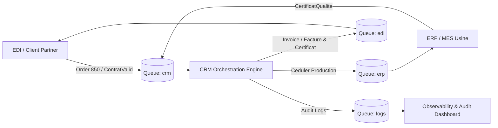

# Documentation Technique d'Architecture : Module CRM / Smart Factory

Ce document détaille l'architecture logicielle, le patron d'orchestration distribuée (**Saga Pattern**) et les protocoles d'intégration du module CRM au sein d'une chaîne de production manufacturière **JIT (Just In Time / Industrie 4.0)**.

---

## 1. Architecture Événementielle Globale (Event-Driven Messaging)
Le système repose sur une architecture orientée micro-services asynchrones et découplés via un courtier de messages **RabbitMQ**. Le CRM n'effectue aucun appel synchrone bloquant vers l'ERP ou l'EDI, garantissant une résilience maximale de la chaîne de production :

*   **File `crm` :** Le CRM écoute les commandes entrantes (ordres d'achat EDI 850, validations de contrats, accusés de réception).
*   **File `erp` :** Le CRM transmet les ordres d'ordonnancement de fabrication (`Ceduler`) à destination du plancher de production (MES / Usine).
*   **File `edi` :** Le CRM publie les confirmations, certificats de conformité qualité et factures finales aux partenaires d'affaires.
*   **File `logs` :** File centralisée d'audit trail et de télémétrie en temps réel pour l'observabilité globale du système d'information industriel.



---

## 2. Le Simulateur Intégré de Flux Partenaires (Mode Autonome)
Afin de valider de bout en bout les règles d'affaires sans dépendre de l'infrastructure physique externe, une suite de simulation interactive est intégrée (Touche **S**).

**Principe de fonctionnement :**
Le module injecte sur le bus RabbitMQ des enveloppes typées simulant des événements distants (EDI partenaire, automate ERP, terminal de paiement) :

```csharp
// Simulation d'une commande entrante d'un client solvable
if (subChoix == "a") 
{
    var envelope = new RMQEnveloppe("ContratValid", "C1", "Actif", "Demande de fabrication conforme");
    await PublishMessageAsync("crm", "ContratValid", JsonSerializer.Serialize(envelope));
}
```

---

## 3. Traçabilité & Audit Trail Distribué (Centralized Observability)
Conformément aux normes industrielles de traçabilité (ISO 9001 / ISA-95), chaque événement de cycle de vie est consigné à deux niveaux :
1. **Journalisation locale persistante :** Écriture horodatée dans des fichiers de log structurés (`/logs/BE{yyyyMMdd}.log`).
2. **Télémétrie distribuée :** Émission asynchrone sur la file `logs` pour ingestion dans une pile d'observabilité (Elasticsearch / Kibana, Prometheus ou dashboard industriel).

```csharp
private static async Task SendRemoteLogAsync(string detail)
{
    var logEntry = new RMQEnveloppe("LOG_RECEPTION", ServiceIdentifier, "Log", detail);
    await PublishMessageAsync(LogQueue, "LOG_RECEPTION", JsonSerializer.Serialize(logEntry));
}
```

---

## 4. Orchestrateur de Saga Industrielle & Règles d'Affaires
Le CRM héberge le moteur de décision qui analyse chaque message entrant et pilote les transitions d'états :
*   **Vérification de solvabilité et validité de contrat :** Avant d'engager les matières premières en usine, le CRM valide la période de validité et le respect du plafond de crédit (`CrmRepository`). En cas d'anomalie, un refus formel est émis.
*   **Ordonnancement de production :** Si le contrat est approuvé, l'ordre de planification (`Ceduler`) est transmis aux ordonnanceurs d'atelier.
*   **Clôture et Facturation :** Dès réception du certificat qualité validant la pièce produite, la facturation officielle est générée et le compte client mis à jour.

---

## 5. Mouchards Réseau & Observabilité Console
Pour faciliter le diagnostic sur site et la mise en service, la console surveille simultanément les files distantes `edi` et `erp` :
*   **Cyan :** Réception d'un message entrant sur `crm`.
*   **Jaune :** Émission d'une commande par le CRM.
*   **Magenta :** Mouchard réseau confirmant la délivrance du message dans les files d'attente ERP/EDI.
*   **Vert :** Décisions automatisées du moteur de règles et validations positives.
*   **Rouge :** Alertes de dépassement de crédit, contrats invalides ou erreurs réseau.

---

## Fichiers de Référence
*   [`Program.cs`](file:///c:/Lab/CRM_AQL/Projet-AQL/src/CRM.MessagingConsole/Program.cs) : Boucle d'événements, configuration RabbitMQ et pilotage.
*   [`Data/CrmRepository.cs`](file:///c:/Lab/CRM_AQL/Projet-AQL/src/CRM.MessagingConsole/Data/CrmRepository.cs) : Modèle relationnel en mémoire, gestion des contrats et solde client.
*   [`Models/RMQEnveloppe.cs`](file:///c:/Lab/CRM_AQL/Projet-AQL/src/CRM.MessagingConsole/Models/RMQEnveloppe.cs) : Contrat de données standardisé et désérialisation sécurisée.
*   [`CRM.Tests/CrmLogicTests.cs`](file:///c:/Lab/CRM_AQL/Projet-AQL/src/CRM.Tests/CrmLogicTests.cs) : Suite de tests unitaires automatisés.
