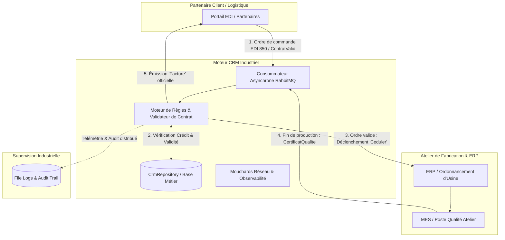

# Industrial CRM & Manufacturing Orchestration Engine (Industry 4.0)

[](https://dotnet.microsoft.com/)
[](https://learn.microsoft.com/dotnet/csharp/)
[](https://www.rabbitmq.com/)
[]()
[]()

> **Moteur middleware d'orchestration manufacturière Just-In-Time (JIT)** conçu pour l'interconnexion résiliente des systèmes **EDI**, **CRM**, **ERP** et **MES** (Manufacturing Execution System) dans une usine connectée (Industrie 4.0).

---

## 🎯 Problématique Industrielle & Métier

Dans un environnement manufacturier moderne opérant en flux tendu (JIT), engager des machines-outils et des matières premières sans validation stricte expose l'usine à des coûts critiques :
- **Commandes non solvables ou sans contrat valide.**
- **Désynchronisation entre les commandes clients (EDI), l'ordonnancement d'atelier (ERP/MES) et la facturation.**
- **Fragilité des architectures monolithiques synchrones** (un appel HTTP qui échoue bloque la ligne de fabrication).

Ce module CRM résout ces défis en agissant comme **orchestrateur d'affaires asynchrone** :
1. **Évaluation de solvabilité temps réel :** Analyse contractuelle et vérification du plafond de crédit avant toute mise en fabrication.
2. **Ordonnancement d'atelier (Saga) :** Déclenchement de la production (`Ceduler`) uniquement si l'ordre est conforme.
3. **Contrôle Qualité & Clôture :** Réception du certificat de conformité usine (`CertificatQualite`) avant libération de la facture finale.
4. **Résilience & Découplage :** Utilisation de RabbitMQ avec acquittements explicites (`ACK`/`NACK`) pour éliminer tout risque de perte d'ordre.

---

## 🏗️ Architecture Globale & Flux d'Orchestration (Saga)



---

## ✨ Fonctionnalités Clés & Compétences Développées

* **Architecture Événementielle (EDA) :** Conception distribuée via RabbitMQ, canaux asynchrones non bloquants, queues dédiées et séparation stricte des responsabilités.
* **Patron Saga Orchestré :** Gestion de transactions distribuées entre le CRM, l'ERP d'atelier et l'EDI client.
* **Tolérance aux Pannes & Résilience :**
  * Auto-reconnexion TCP préliminaire.
  * Adaptation dynamique aux files durables/non-durables.
  * Décodage résilient des enveloppes de données (fallback gracieux en cas de payload corrompu).
* **Moteur de Règles Financières & Solvabilité :**
  * Validation des dates d'effet du contrat.
  * Vérification du plafond de crédit dynamique (`SoldeActuel < MontantMaxCredit`).
  * Calcul comptable en temps réel des factures émises et des règlements perçus.
* **Audit Trail & Observabilité :**
  * Double journalisation horodatée (fichiers locaux structurés `/logs` et file RabbitMQ centralisée).
  * Système de mouchards réseau en temps réel pour le diagnostic en atelier.
* **Suite de Tests Automatisée :** 7 tests unitaires couvrant la logique contractuelle, la comptabilité et la robustesse de sérialisation.

---

## 📂 Structure du Répertoire

```text
Projet-AQL/
├── docs/                           # Documentation d'ingénierie détaillée
│   ├── FunctionalSpecs.md          # Spécifications fonctionnelles et cas d'usage JIT
│   ├── TechnicalSpecs.md           # Spécifications d'infrastructure RabbitMQ & C#
│   ├── RiskAnalysis.md             # Matrice des risques et plans d'atténuation
│   └── TestPlan.md                 # Stratégie de tests unitaires, intégration et acceptation
├── src/
│   ├── CRM.MessagingConsole/       # Service d'orchestration principal C# (.NET 8)
│   │   ├── Data/
│   │   │   └── CrmRepository.cs    # Moteur de données (Contrats, Transactions, Soldes)
│   │   ├── Models/
│   │   │   └── RMQEnveloppe.cs     # Contrat de données standard inter-systèmes
│   │   └── Program.cs              # Boucle d'événements, gestion AMQP et console de supervision
│   └── CRM.Tests/                  # Suite de tests unitaires (MSTest / xUnit)
│       └── CrmLogicTests.cs        # Tests de validation métier, sérialisation et solvabilité
├── Documentation_Equipe_CRM.md     # Architecture détaillée et guide d'exploitation
├── run.bat                         # Script d'exécution avec validation préalable des tests
└── Projet-AQL.sln                  # Solution Visual Studio
```

---

## 🚀 Démarrage Rapide

### Prérequis
- [.NET 8.0 SDK](https://dotnet.microsoft.com/download/dotnet/8.0) ou supérieur.
- Serveur RabbitMQ actif (accessible localement ou sur le réseau).

### 1. Exécution des Tests Unitaires
```bash
dotnet test src/CRM.Tests/CRM.Tests.csproj --nologo
```
*Sortie attendue : 7 tests réussis, 0 échec.*

### 2. Lancement du Service CRM
Sous Windows :
```cmd
run.bat
```
Ou via la CLI .NET :
```bash
dotnet run --project src/CRM.MessagingConsole/CRM.MessagingConsole.csproj
```

---

## 🧪 Scénarios de Validation Métier (Démonstration)

La console propose un menu interactif ainsi qu'un simulateur intégré (touche **S**) pour reproduire les scénarios d'usine :

| Touche | Scénario Industriel | Résultat Observé |
| :---: | :--- | :--- |
| **S -> a** | Commande client solvable (`C1`) | ✅ Contrat approuvé -> Recommandation d'envoyer l'ordre `Ceduler` à l'usine |
| **S -> d** | Commande client avec plafond dépassé (`C2`) | ❌ Refus automatique immédiat -> Ordre `ContratRefuse` émis vers l'EDI |
| **1** | Ordre de fabrication | 🏭 Message `Ceduler` transmis à la file `erp` |
| **S -> b** | Réception fin de fabrication usine | 📋 Certificat qualité reçu -> Prêt pour facturation |
| **3** | Facturation | 💵 Facture officielle transmise à l'EDI et transaction débitée au compte client |
| **S -> c** | Réception d'un règlement | 💳 Paiement crédité et mise à jour automatique du solde client |

---

## 👨‍💻 Développé par
* **Esdra** – Ingénierie Logicielle & Intégration Industrielle (C# .NET / RabbitMQ / EDA)
