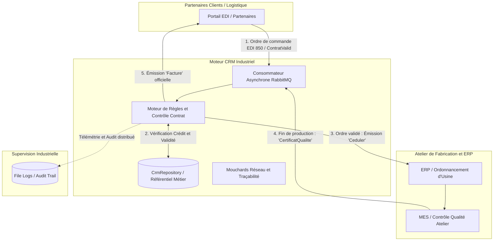

# Industrial CRM & Manufacturing Orchestration Engine

[](https://dotnet.microsoft.com/)
[](https://learn.microsoft.com/dotnet/csharp/)
[](https://www.rabbitmq.com/)
[]()
[]()

> Moteur middleware d'orchestration manufacturière Just-In-Time (JIT) conçu pour l'interconnexion résiliente des systèmes EDI, CRM, ERP et MES (Manufacturing Execution System) au sein d'une usine connectée (Industrie 4.0).

---

## Problématique Industrielle et Métier

En environnement manufacturier opérant en flux tendu (JIT), mobiliser des matières premières et des lignes d'assemblage sans contrôle contractuel préalable engendre des coûts critiques :
- Production engagée pour des clients insolvables ou aux contrats expirés.
- Désynchronisation entre les commandes clients (EDI), l'ordonnancement d'atelier (ERP/MES) et la facturation.
- Dépendances synchrones fragiles pouvant bloquer la chaîne de production en cas de panne réseau.

Ce module CRM agit comme orchestrateur asynchrone pour sécuriser le flux :
1. **Évaluation de solvabilité en temps réel :** Validation contractuelle et contrôle strict du plafond de crédit avant déclenchement d'usine.
2. **Ordonnancement d'atelier (Saga) :** Émission de l'ordre de fabrication (`Ceduler`) uniquement si les conditions d'affaires sont réunies.
3. **Contrôle Qualité et Clôture :** Réception du certificat de conformité usine (`CertificatQualite`) avant émission de la facture finale.
4. **Découplage et Résilience :** Utilisation de files RabbitMQ avec acquittements explicites (`ACK`/`NACK`) pour éliminer tout risque de perte de message.

---

## Architecture et Flux d'Orchestration



---

## Fonctionnalités Clés et Architecture Logicielle

- **Architecture Orientée Événements (EDA) :** Conception asynchrone non-bloquante via RabbitMQ, canaux dédiés et découplage total des composants.
- **Patron Saga Orchestré :** Coordination de transactions distribuées entre le CRM, l'ordonnancement d'atelier (ERP) et l'EDI client.
- **Tolérance aux Pannes et Résilience :**
  - Sonde TCP préliminaire validant la disponibilité du courtier.
  - Gestion dynamique de la durabilité des files d'attente (durable / non-durable).
  - Décodage résilient des enveloppes de données avec gestion des cas d'erreur sans interruption de service.
- **Moteur de Règles Financières :**
  - Contrôle d'échéance des contrats.
  - Calcul dynamique de l'encours client (`SoldeActuel < MontantMaxCredit`).
  - Réconciliation instantanée des factures et paiements reçus.
- **Audit Trail et Observabilité :**
  - Double journalisation horodatée (fichiers locaux structurés `/logs` et file RabbitMQ centralisée).
  - Écoute active des canaux partenaires pour le diagnostic en temps réel.
- **Couverture de Tests :** Suite de 7 tests unitaires automatisés validant la logique métier et la robustesse AMQP.

---

## Structure du Répertoire

```text
Projet-AQL/
├── docs/                           # Documentation d'ingénierie
│   ├── FunctionalSpecs.md          # Spécifications fonctionnelles et règles JIT
│   ├── TechnicalSpecs.md           # Spécifications d'infrastructure RabbitMQ & C#
│   ├── RiskAnalysis.md             # Matrice des risques industriels et atténuation
│   └── TestPlan.md                 # Stratégie de tests unitaires et d'intégration
├── src/
│   ├── CRM.MessagingConsole/       # Service d'orchestration principal C# (.NET 8)
│   │   ├── Data/
│   │   │   └── CrmRepository.cs    # Référentiel de données (Contrats, Transactions)
│   │   ├── Models/
│   │   │   └── RMQEnveloppe.cs     # Contrat d'échange standard inter-systèmes
│   │   └── Program.cs              # Boucle d'événements AMQP et console de supervision
│   └── CRM.Tests/                  # Suite de tests automatisés (MSTest)
│       └── CrmLogicTests.cs        # Tests de validation contractuelle et solvabilité
├── Documentation_Equipe_CRM.md     # Architecture détaillée et guide d'exploitation
├── run.bat                         # Script d'exécution avec contrôle préalable des tests
└── Projet-AQL.sln                  # Solution Visual Studio
```

---

## Démarrage Rapide

### Prérequis
- .NET 8.0 SDK ou supérieur.
- Serveur RabbitMQ actif sur le réseau ou en local.

### 1. Exécution des Tests Unitaires
```bash
dotnet test src/CRM.Tests/CRM.Tests.csproj --nologo
```
*Résultat : 7 tests réussis, 0 échec.*

### 2. Lancement du Service
Sous Windows :
```cmd
run.bat
```
Via la CLI .NET :
```bash
dotnet run --project src/CRM.MessagingConsole/CRM.MessagingConsole.csproj
```

---

## Scénarios de Validation Métier

La console propose un menu de navigation et un simulateur interactif (touche **S**) permettant de valider les scénarios industriels :

| Commande | Scénario Industriel | Résultat Observé |
| :---: | :--- | :--- |
| **S -> a** | Commande client solvable (`C1`) | Succès : Contrat validé, recommandation d'émission de l'ordre `Ceduler` |
| **S -> d** | Commande avec plafond dépassé (`C2`) | Rejet immédiat : Notification `ContratRefuse` émise vers l'EDI |
| **1** | Ordre de fabrication | Émission : Ordre `Ceduler` expédié vers la file `erp` |
| **S -> b** | Réception fin de fabrication usine | Conformité : Certificat qualité reçu, déblocage de la facturation |
| **3** | Facturation | Clôture : Facture officielle envoyée à l'EDI et compte client débité |
| **S -> c** | Réception d'un règlement | Encaissement : Solde mis à jour automatiquement |

---

## Auteur
* **Esdras** – Ingénierie Logicielle et Systèmes Industriels (C# .NET / RabbitMQ / EDA)
